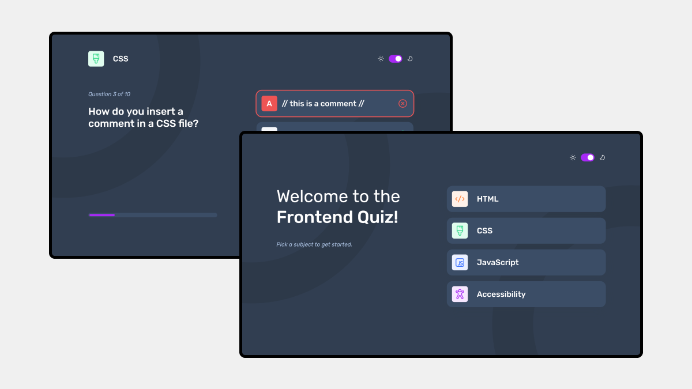
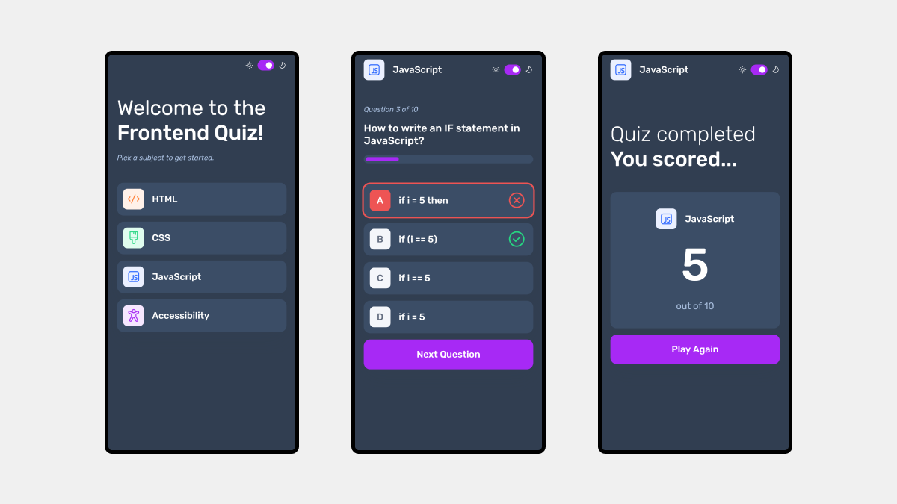

# Frontend Mentor - Frontend quiz app solution

This is a solution to the
[Frontend quiz app challenge on Frontend Mentor](https://www.frontendmentor.io/challenges/frontend-quiz-app-BE7xkzXQnU).
Frontend Mentor challenges help me improve my coding skills by building realistic projects.

## Table of contents

- [Overview](#overview)
  - [The challenge](#the-challenge)
  - [Screenshot](#screenshot)
  - [Links](#links)
- [My process](#my-process)
  - [Built with](#built-with)
  - [What I learned](#what-i-learned)
  - [Continued development](#continued-development)
- [Author](#author)
- [Acknowledgments](#acknowledgments)

## Overview

### Personal Achievements

As I completed the challenge, I successfully accomplished the following:

- **Subject Selection**: I implemented a feature allowing users to choose a quiz subject from a
  selection of options.

- **Answer Selection**: Users can select a single answer from a set of four choices for each
  question.

- **Error Handling**: I ensured that users receive an error message if they attempt to submit an
  answer without making a selection.

- **Feedback on Answers**: Users are provided with immediate feedback on whether their answer is
  correct or incorrect upon submission.

- **Progression**: Users can smoothly move on to the next question after viewing the result of the
  current question.

- **Completion State**: Upon completing the final question, users are presented with their total
  score.

- **Replay Option**: I implemented the functionality for users to play again and choose another quiz
  subject.

- **Responsive Design**: The interface dynamically adjusts its layout to provide an optimal viewing
  experience based on the user's device screen size.

- **Interactive States**: Users can clearly see hover and focus states for all interactive elements
  on the page, enhancing usability.

- **Keyboard Navigation**: I ensured that users can navigate through the entire app using only their
  keyboard, enhancing accessibility.

- **Theme Customization**: Additionally, I implemented the option for users to switch between light
  and dark themes for the app, providing a personalized experience.

These achievements demonstrate my ability to create a user-friendly and interactive quiz application
that caters to various user needs and preferences.

### Screenshot

#### Desktop

#### Mobile

### Links

- Solution URL: 
- Live Site URL: 

## My process

### Built with

- Semantic HTML5 markup
- CSS custom properties
- CSS modules
- Flexbox
- CSS Grid
- Mobile-first workflow
- [React](https://react.dev) - JS library

### What I learned

Throughout this project, I gained valuable insights and deepened my understanding of various
concepts and technologies. Here are some of the major learnings I'd like to highlight:

1. **Frontend Development Skills**: I enhanced my frontend development skills by working on this
   project. I improved my proficiency in HTML, CSS, and JavaScript, particularly in building
   interactive web applications.

2. **Responsive Design**: I enhanced my responsive designs skill that adapt to different screen
   sizes and devices. Utilizing media queries and flexible layouts, I ensured that the quiz
   application looks great on desktops, tablets, and mobile devices.

3. **React Component Structure**: I gained proficiency in organizing my application's components in
   a structured and modular way, following React best practices. Breaking down the user interface
   into reusable components improved code readability and maintainability.

4. **React Hooks and Context**: I explored advanced React concepts such as custom hooks and context
   API to share state and logic across multiple components efficiently. Leveraging React hooks and
   context simplified state management and reduced prop drilling in complex component hierarchies.

Overall, working with React on this project was a valuable learning experience, empowering me to
build dynamic and interactive web applications with a focus on code reusability, maintainability,
and performance.

### Continued development

While completing this project, I encountered several areas where I can continue to focus and improve
in future projects. Here are some key areas I plan to prioritize:

1. **Advanced React Patterns**: I aim to deepen my understanding of advanced React patterns such as
   compound components, render props, and higher-order components. Mastering these patterns will
   enable me to build more flexible and reusable components in my applications.

2. **Optimizing Performance**: Improving the performance of my React applications is a priority for
   future projects. I plan to focus on techniques such as code splitting, lazy loading, and
   memoization to optimize rendering and reduce load times, especially for larger applications.

3. **Testing React Applications**: I recognize the importance of writing comprehensive tests for
   React applications to ensure code reliability and maintainability. In future projects, I intend
   to strengthen my testing skills with tools like Jest and React Testing Library to write unit
   tests, integration tests, and end-to-end tests.

## Author

- Website - [Sergejs Ivcenko](https://sergejs-ivcenko.com)
- Frontend Mentor - [@Sergio0831](https://www.frontendmentor.io/profile/Sergio0831)
- LinkedIn - [ivcenko](https://www.linkedin.com/in/ivcenko)
